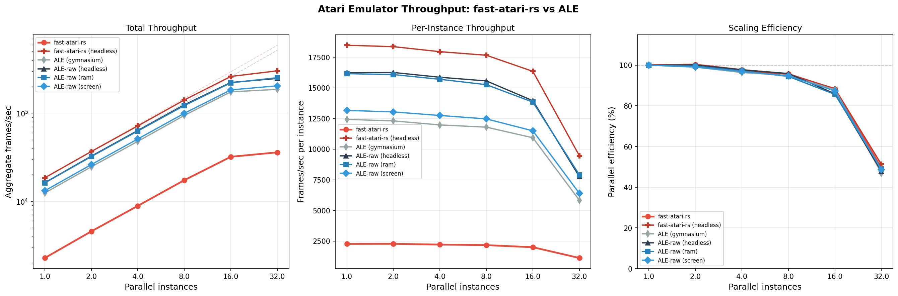

The goal of this is to make a version of ALE that can run on 1M+ (aggregate) SPS on a single 4090.

I am going to start with getting the CPU working in a way that transfers well to the CUDA code that I will have to write later.

All credit to https://github.com/Klaus2m5/6502_65C02_functional_tests for the tests. They are essential to having any idea of what is going on.

~~Note: Cycle count is sometimes wrong. As I am not implmenting a TIA, I will not be fixing that.~~

Turns out it is really easy to fix. There is a difference between pragmatism and laziness.

## Benchmarks

### fast-atari-rs vs ALE (Gymnasium)



#### Headless throughput (Breakout, single-threaded)

| Emulator | FPS |
|---|---|
| fast-atari-rs (headless, WSYNC fast-forward) | **12,283** |
| fast-atari-rs (headless) | 10,118 |
| ALE-raw (headless, no obs) | 16,240 |
| ALE-raw (screen obs) | 13,164 |
| ALE (gymnasium) | 12,429 |
| fast-atari-rs (rendering) | 2,268 |

#### Aggregate throughput at 32 cores

| Emulator | FPS | Efficiency |
|---|---|---|
| ALE-raw (headless) | 248,310 | 47.8% |
| **fast-atari-rs (headless)** | **210,129** | **53.5%** |
| ALE (gymnasium) | 186,683 | 46.9% |

fast-atari-rs headless is within 1.3x of ALE's raw C++ core per-thread, with better parallel scaling. The architecture is intentionally simple (no jump tables, no computed goto) to facilitate a future CUDA port.

### Profiling (headless mode)

| Function | % time |
|---|---|
| `Cpu::step` (instruction dispatch) | 32.0% |
| `run_one_cycle` (frame loop + component ticking) | 31.6% |
| `HeadlessBus::read` (address decoding) | 19.9% |
| `Cpu::resolve_addr` | 5.5% |
| `OpCode::details` | 3.0% |
| Other | 8.0% |

### Running benchmarks

```bash
# fast-atari-rs scaling benchmark (rendering + headless)
cargo run --release --example benchmark -- <ROM> [MAX_THREADS] [SECONDS]

# ALE comparison (requires gymnasium + ale-py in .venv)
.venv/bin/python bench_ale.py [MAX_WORKERS] [SECONDS]
.venv/bin/python bench_ale_raw.py [MAX_WORKERS] [SECONDS]

# Generate comparison plot
.venv/bin/python plot_benchmark.py
```